## Humidity Monitor: Feather + E Ink

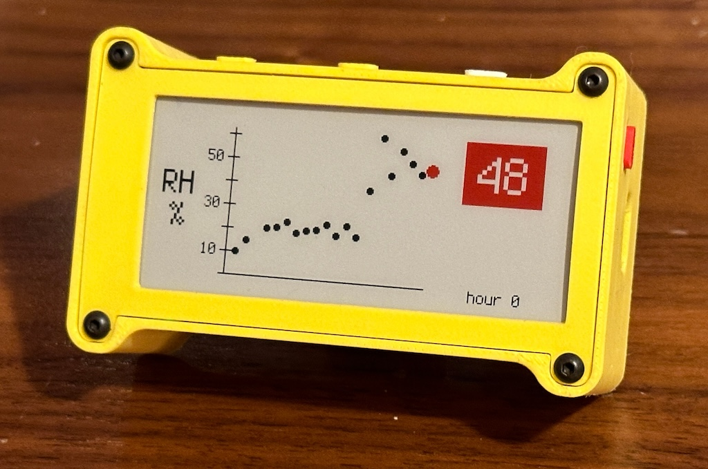

## Overview

A humidity monitor and logger, using an E Ink display to show the recent and historical humidity with almost zero power draw (the embedded system stays in sleep mode, just waking up once an hour to read a sensor and update the display).

This was a very quick project (3 evenings, ~12 hours not counting this writeup). 

## Background

I recently picked up a 3D printer for my 'home lab', partly to make it faster to build cases for various electronics projects I work on.

I plan to store my extra printer filament in a dry box with desiccant, and wanted to throw a humidity monitor into the box-- instead of buying one, maybe I should make one (and this would be an excuse to try quick iterations on case design).

I had other projects to work on, so I told myself "If I can build a working prototype in one evening with parts I have around, I'll let myself spend a few more days polishing it."

I rarely document one-off projects like this, but I thought it would be useful/fun for when I look back at it in the future, so I took photos and screenshots along the way to let me reconstruct the process after the fact.

## Development Log

### Day 1 -- Working Prototype

Notebook sketch concept:
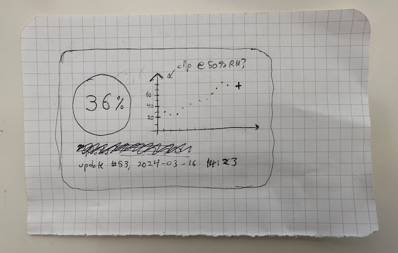

Components I had kicking around the shop, including a [Feather M4 Express](https://www.adafruit.com/product/3857) with a 120 Mhz Cortex M4 SAMD51 processor, a [2.9" Tri-color E Ink display](https://www.adafruit.com/product/4778), and an [AHT20 I2C capacitive humidity sensor](http://www.aosong.com/en/products-32.html) on a [breakout board](https://www.adafruit.com/product/4566):
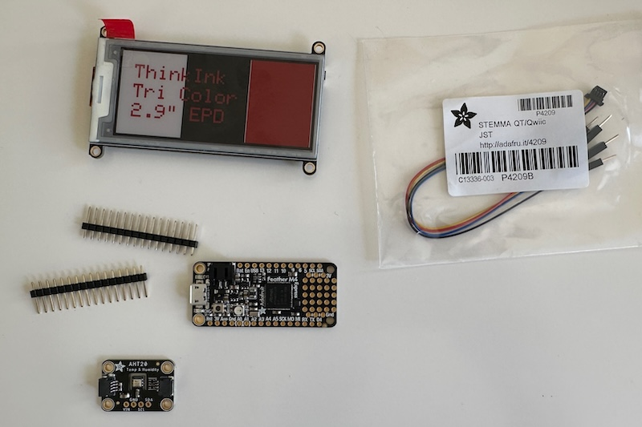

First I soldered headers onto the Feather PCB (tip: insert the headers into the mating display board while soldering to keep them aligned):
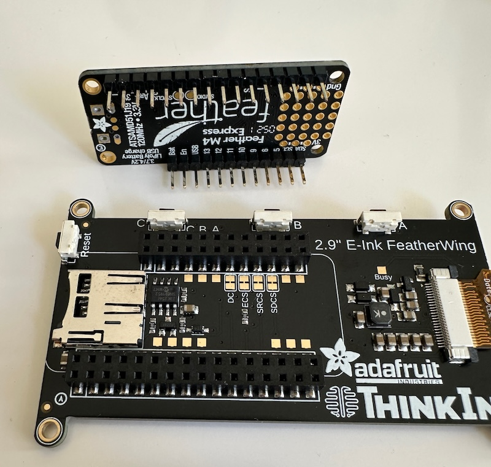

Then I hooked up the relevant I2C bus pins to the sensor:
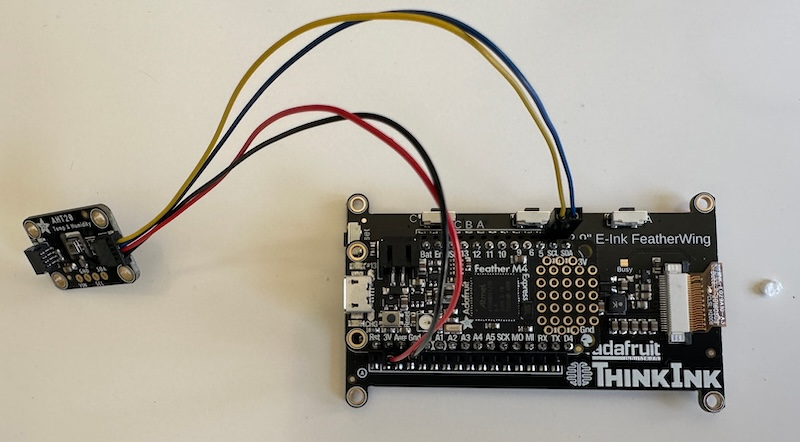

I connected the Feather to my laptop to update the firmware and start programming, but wasn't able to communicate with it. I wasted more minutes than I want to admit before I figured out the USB cable I'd grabbed was a charging-only cable with no data connection.
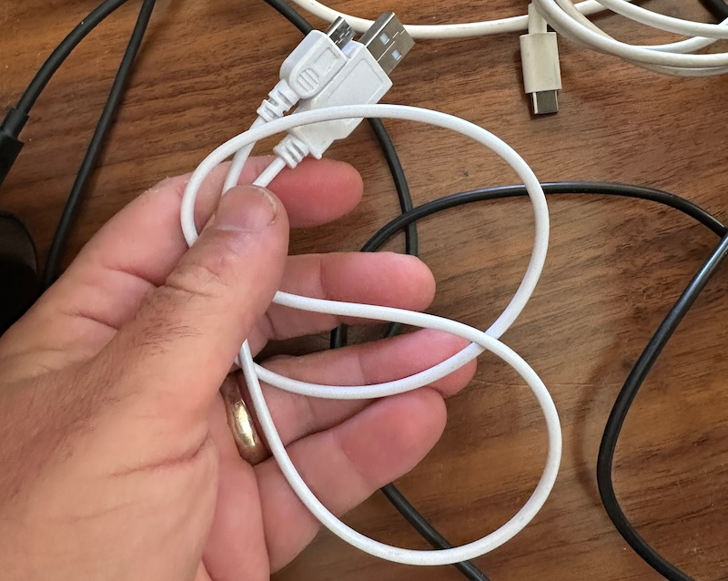

Now I was able to load CircuitPython onto the device. I always start with some basic 'blink an LED' code to check my workflow:
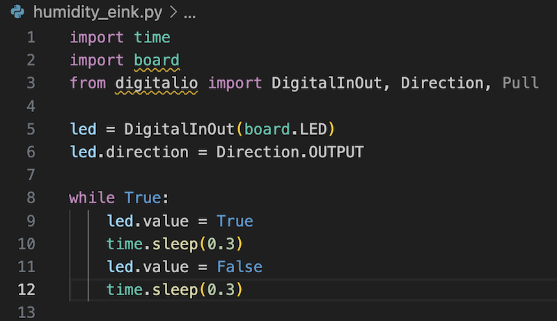

Next, I loaded some sample code from [Adafruit's excellent-as-always documentation](https://learn.adafruit.com/adafruit-2-9-eink-display-breakouts-and-featherwings/overview), verifying I could display an image on the E Ink`.

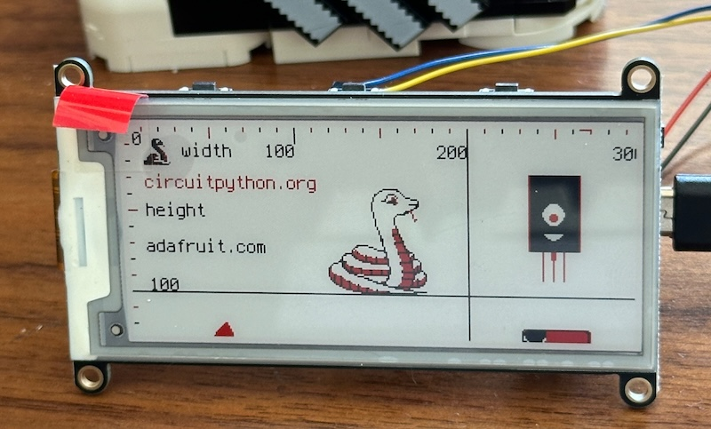

I brushed up on the [`displayio`](https://docs.circuitpython.org/en/latest/shared-bindings/displayio/) library which I've used in the past to composite elements into an image and wrote a few lines of code. Oops, I forgot that (x,y) coordinates in displayio anchor by default to the vertical center of text:
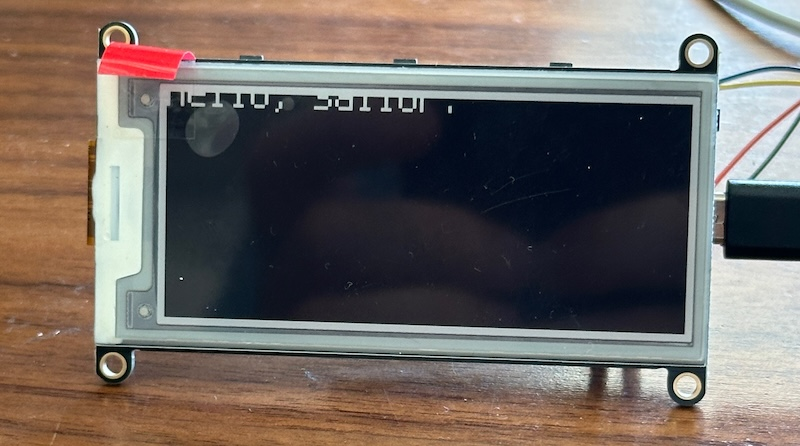

Fixed:
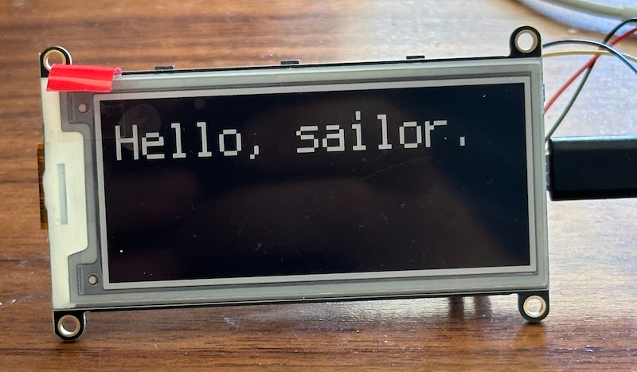

For simple projects like this, I'm a big fan of 'printf debugging'-- just printing program status out to a serial terminal for quick feedback. I connected a terminal window to the Feather's serial-over-USB connection:
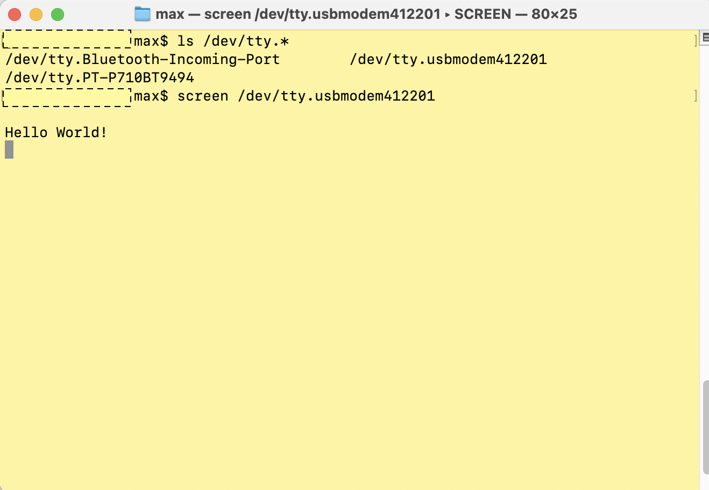

Now I wanted to communicate to the humidity sensor over I2C. One of the features of Python I love is the easy REPL / shell, allowing interactive command exploration. I read the documentation and tried out a few commands, and was able to communicate to the sensor, verifying it works the way I think and I have it wired up correctly:

Now that I know it works, I integrated I2C code into my basic test program and displayed it:
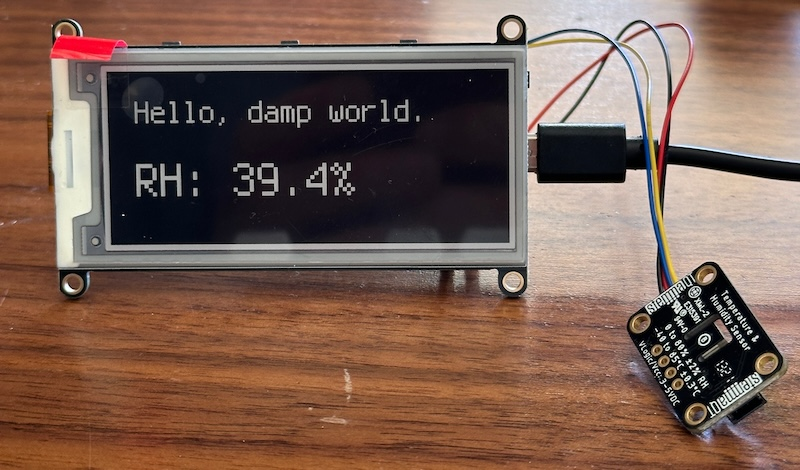

This moment was about an hour and a half from when I had the idea and started this project. It's a key prototype milestone-- now that I know it's possible with components I have on hand, I'm excited to spend some more time on it.

I took a break to set up a git repository, back up my work in progress, and arrange my monitor windows the way I like them for more focused work. 
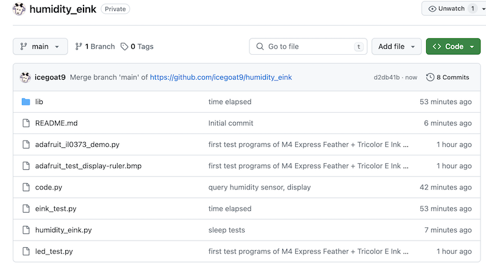

Now let's dive back in.

I played around with color and formatting settings for this display (I'm only using this much slower three-color E Ink display instead of a black and white one because it's what I had on hand... but since I have it I might as well use the accent color):
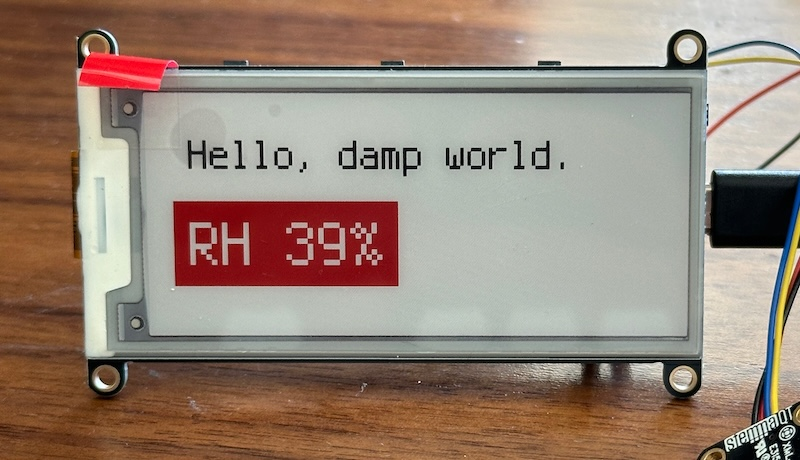

Now I swapped in a small LiPoly battery instead of USB power, since the intent is to make this battery-powered:
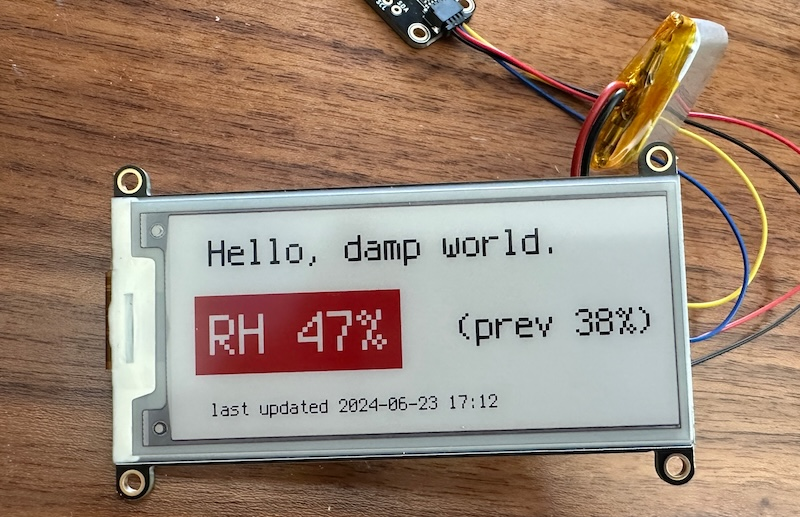

I spent a bit of time brushing up on low-power sleep modes using [`alarm.sleep`](https://learn.adafruit.com/deep-sleep-with-circuitpython/alarms-and-sleep) and wrote some test code to check I could have the system sleep and then wake itself up on some schedule. The onboard RTC time and date don't seem to persist across a sleep/wake the way I'm using it, but I don't really need an accurate time so I'll ignore that for now:
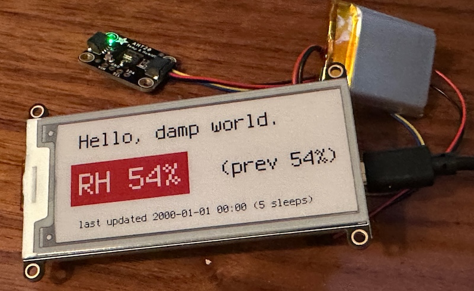

There's more to do on making this look good, but let's make a case for all these loose components and wires. I'm fortunate to have a small 3D printer in my home lab, and using the PCB documentation as a starting point, in a bit over an hour I had a basic case designed and printed (about 40 minute print time with coarse draft settings):

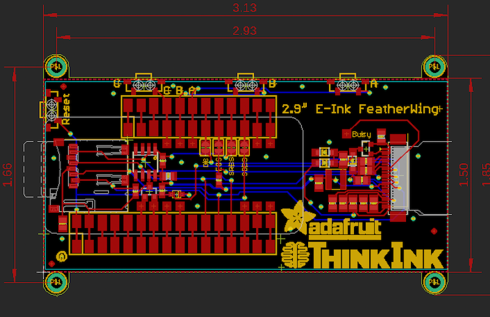
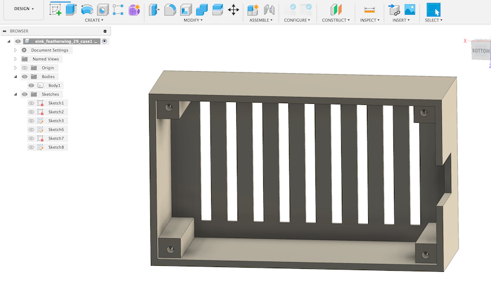
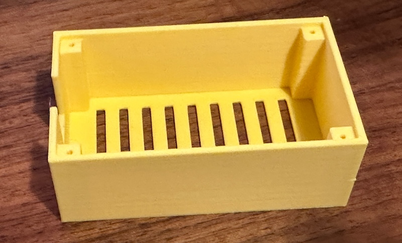

The enclosure didn't fit perfectly (I needed slightly more PCB clearance in a few areas, but when it's this fast to design / build / test, I don't spend as much time trying to get every dimension perfect on the first try), but it worked well enough that I could dry fit the components in to it and set it inside my storage bin to imagine what it would look like:
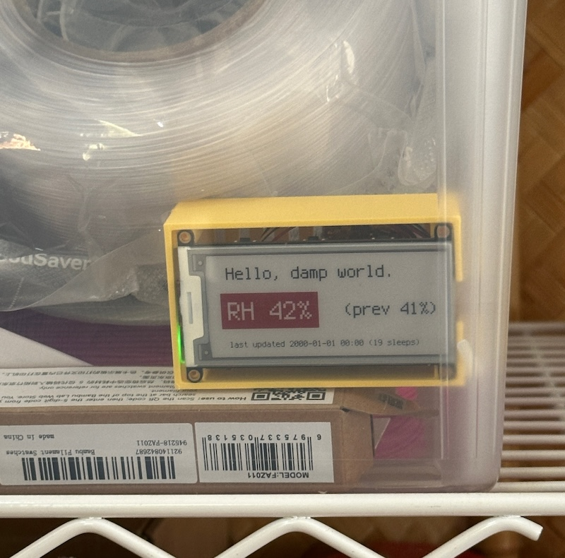

I set the system to wake up once an hour, update the display, and return to low-power sleep mode, and this is where I left it after my first evening on the project. Actually, I also fixed a few minor fit issues on the case design and set it to 3D print overnight. 

## Day 2

To some extent, this rough prototype is already 'good enough'-- I can see the humidity inside the box. But I wanted to put a few more hours of polish into it.

I went through a few more iterations of case design, fixing fit issues and adding mounting holes for the sensor.

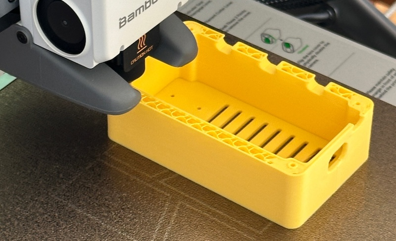

A robust design might heat-set threaded metal inserts into the case for strong screw connections, or design in some plastic snap tabs, but for this kind of quick project I find I can usually tap threads directly into the 3D printed plastic if I'm careful and only going to open and close it a few times ever (in the 3D printer slicer I need to remember to set infill density to 100% in those areas or for the whole part, so there's material to bite into, not just a thin wall):

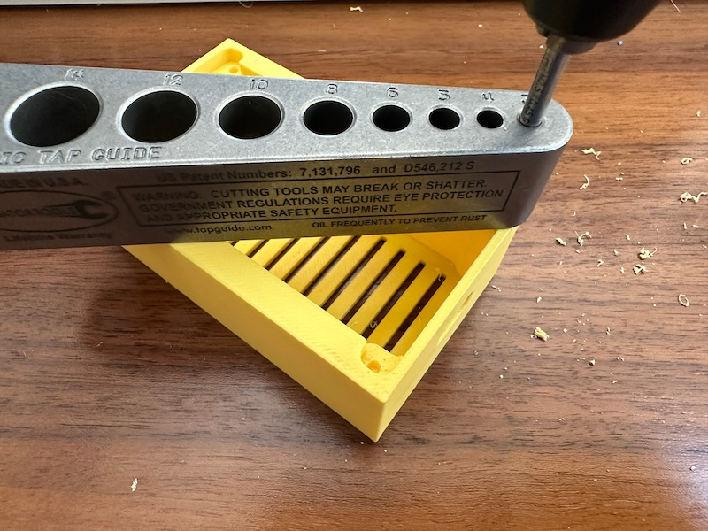

Also, since I have all this display space, maybe I could do something more interesting than just print text, such as keep an internal log of humidity over time and graph it.

I tested the CircuitPython [`display_shapes`](https://docs.circuitpython.org/projects/display-shapes/en/latest/) sparkline module, but didn't love how it looked:

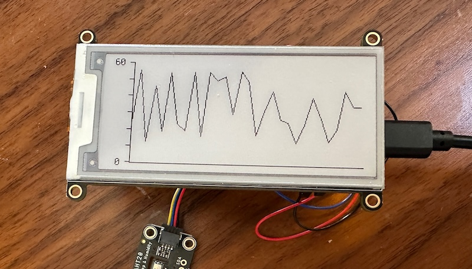

I decided to make my own chart drawing routine, using the line and circle primitives from `display_shapes`. To iterate quickly on ideas, I wrote some throwaway code using some hard-coded dummy data that just draws a set graph to the screen. After playing around with some math and settings for a while, I came up with this layout, which I liked:

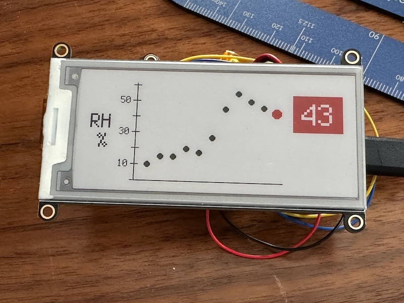

This was just a mockup, so I spent another hour or two cleaning up the code and building this functionality in my main program. From memory, this mostly involved:
* Setting up a circular buffer for humidity data.
* Functions to load and save data from [backup RAM / sleep memory](https://learn.adafruit.com/deep-sleep-with-circuitpython/sleep-memory)-- otherwise every time the system went into deep sleep all variables would be re-initialized. 
* Rather that re-creating the entire displayio image every time we have new data, just updating the y position of the existing data dots.

After a few tests this seemed to work as intended.

Continuing my shuffle between hardware and software, I then did one more iteration on case design, with a top sheet that frames the display more nicely:

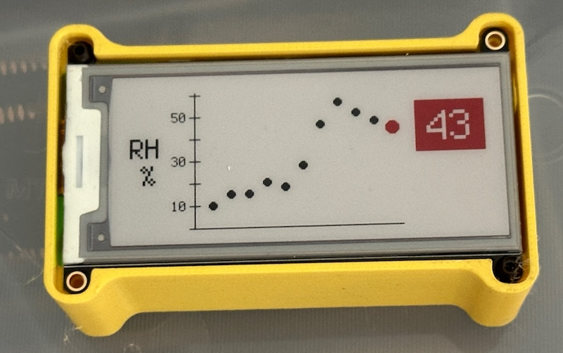
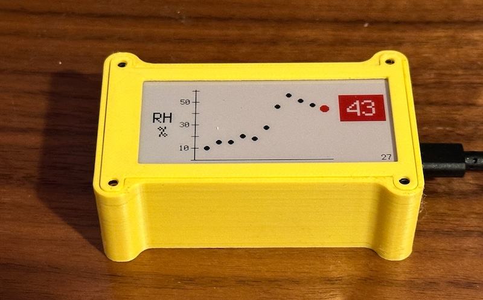

This is where I left the project at the end of about four hours of work on day two. Basically done other than putting in the screws. *Or is it...?*

### Day 3

It's *good enough* at this point, really, and I have other things to be working on, but I have time for a few final touches.

One challenge with humidity sensors in general is that many of them lose substantial accuracy outside the 20-80% RH range:

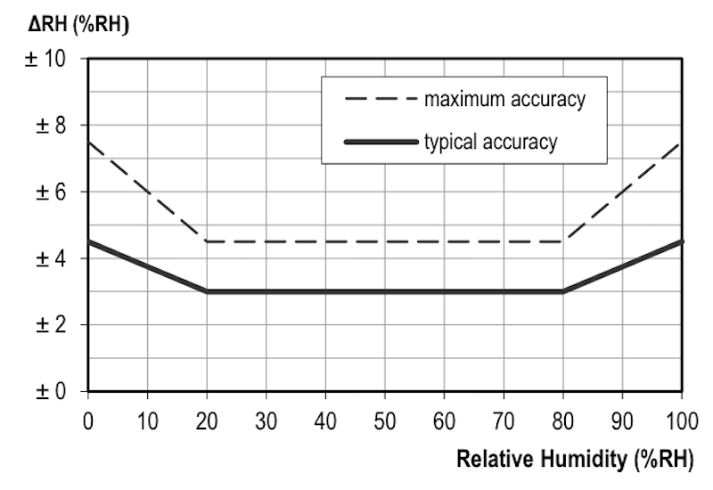

That may not really matter for this project, but I wanted something better-- so back on Day 1 I had ordered a higher-accuracy humidity sensor, the SHT45:

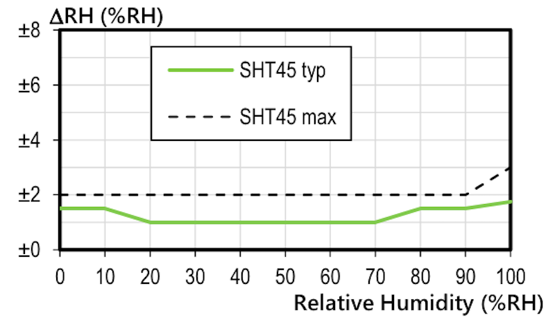

It arrived today (this 'Day 3' is a few days after Day 2, after a break from the project), so I swapped it in along with a few lines of changed code. Fortunately the breakout PCB it's on has the same mounting hole locations:

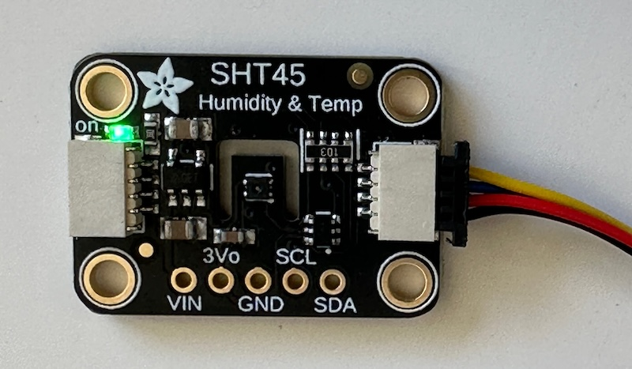

Hmm, here's a wrinkle-- there's a constantly-on power LED on this board, which is a waste of our limited battery. I took a minute to desolder it (I wish I had a better magnifier):

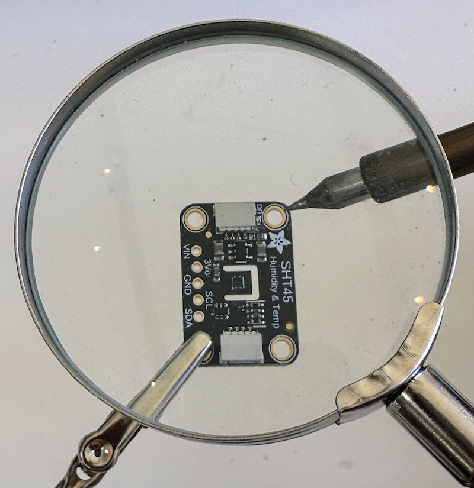

As I prepared to assemble everything, I realized there was one more opportunity for improvement-- it would be nice to be able to press the hard reset button on the PCB without unscrewing the whole enclosure.

Maybe I should redesign the case to have a slot lined up with that button. I could even 3D print a plastic button cap to sit in the hole in the case so I don't have to poke a screwdriver into the hole to hit the button.

And if I'm adding a cutout and button... the E Ink display board I'm using has a few pushbuttons on its PCB which connect to pins on the processor. I'm not using them for anything currently, but maybe in the future they could toggle between different graphs and displays (temperature, etc), so if I might as well make them accessible as well...

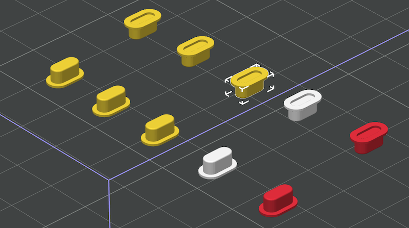

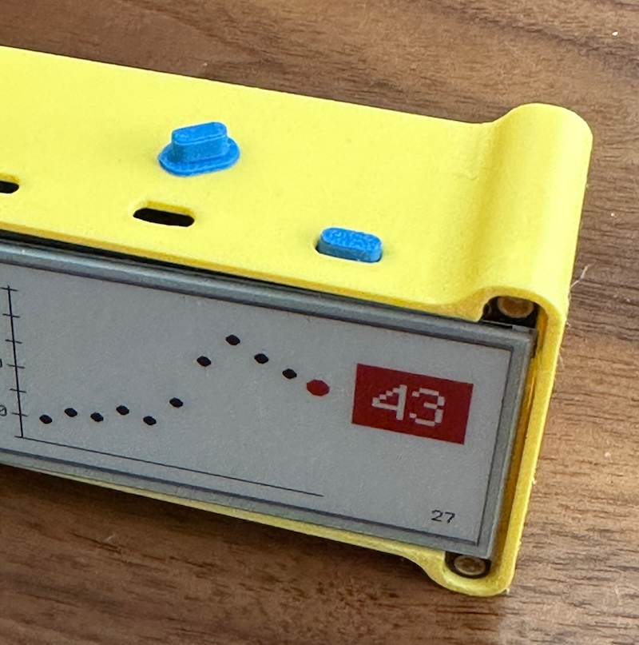

Okay, time for the final assembly push.

Let's hot-glue a few jumper wires in place so they don't slide loose (if this were a real product, I'd build a custom cable with a locking connector or a custom PCB, but this is just a one-off and I'm trying to move fast):

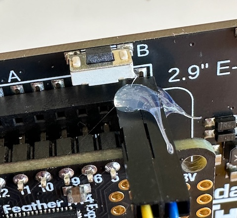

I tapped all the holes, screwed down the sensor board, staged all the buttons in their slots, and used a piece of tape to hold them in place (reminder to self: before I did this, I had many frustrating assembly attempts where one button would fall out of its hole into the case just as I slid the PCB in place):

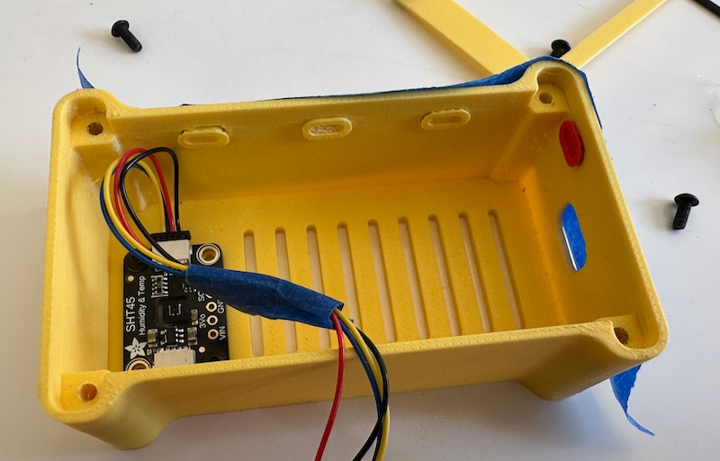

And... the final result!

Now it's tucked away in the box of filament, logging data.

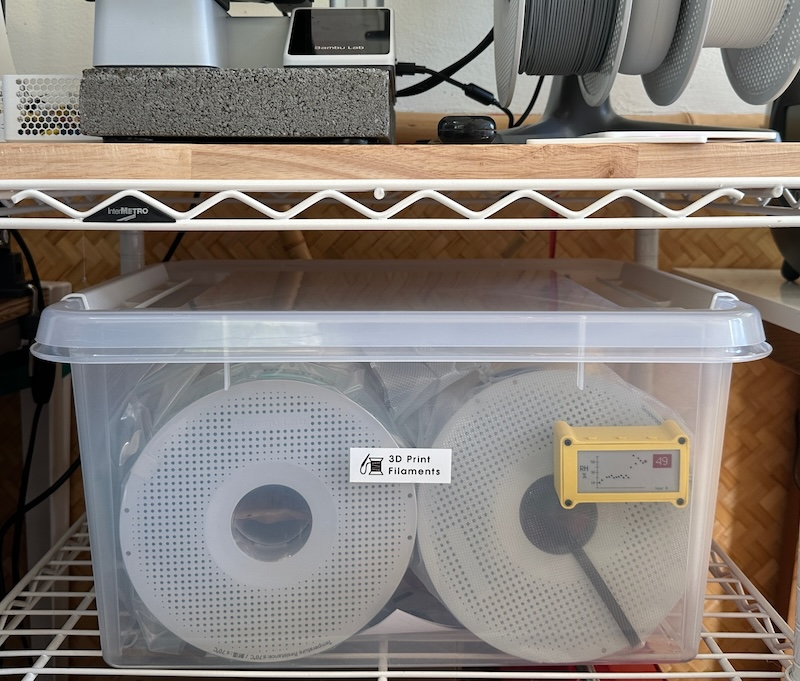

### Time Invested

By looking back at some notes and the timestamps on photos and screenshots I took along the way, it looks like I spent about 12 hours on this project spread over three days.

## Future Ideas

I'm calling this done for now to catch up on other work, but I have a few ideas for future extensions:

* Instead of just buffering the last 24 hours of readings in backup RAM, buffer weeks or months of readings, and change the graph to a box plot (one box per day for the past month)
  * Log humidity to our tiny 2MB flash memory for storage even after a reset or the battery runs down
* Dig into why the internal RTC resets-- maybe add an external I2C RTC with a tiny coin cell battery backup
* Measure actual power draw in various states and estimate battery life-- if needed, look into other power reduction methods (I haven't used sleep modes on this particular processor before and haven't looked under the hood into what the Python abstractions actually do in light vs. deep sleep modes relative to the processor low-level features)
  * Update: this first prototype seems to run for about three weeks / 450 screen refreshes between charges, which is less than expected (I've build some similar-scale battery-powered systems using different processes that run 3-6 months between charges), so I need to dig into the details of the deep sleep mode as well as any peripherals with background power draw 
* Integrate the buttons on the top of the case to provide some new functionality such as:
  * Switch between multiple display formats (large humidity number, graph, humidity and temperature, and so on)
  * Wake the sensor from sleep and take an immediate reading (likely not possible on this system as built because these particular pins don't appear to have external hardware interrupts, but possible if I rewired it or switched to an ESP32 Feather)
* Revise the case design to remove the visible seam on the faceplate
* Swap in a WiFi-enabled embedded board, log data to the cloud (but I expect this would dramatically cut battery life)

