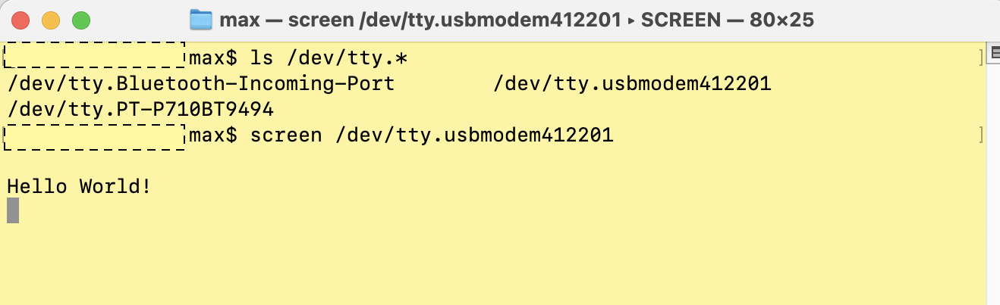
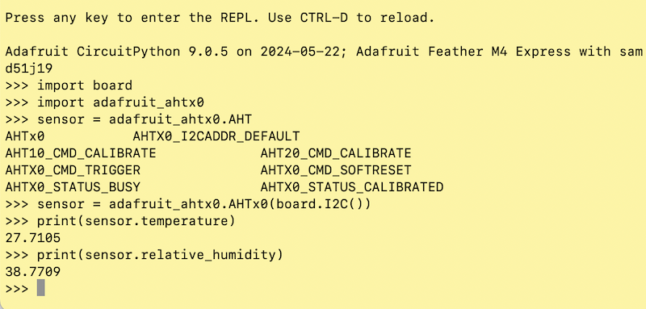

## Humidity Monitor: Feather + E Ink

## Overview

A humidity monitor and logger, using an E Ink display to show the recent and historical humidity with almost zero power draw (the embedded system stays in sleep mode, just waking up once an hour to read a sensor and update the display).

This was a very quick project (3 evenings, ~12 hours not counting this writeup). 

## Background

I recently picked up a 3D printer for my 'home lab', partly to make it faster to build cases for various electronics projects I work on.

I plan to store my extra printer filament in a dry box with desiccant, and wanted to throw a humidity monitor into the box-- so rather than buy one, decided to make one.

I had other things to work on, so I told myself "If I can build a proof of concept prototype in one evening with parts I have around, I'll let myself spend a few more days polishing it."

I rarely document one-off projects like this, but I thought it would be useful/fun for when I look back at it in the future, so I took photos and screenshots along the way so I could reconstruct the process after the fact.

## Development Log

### Day 1 -- Working Prototype

Notebook sketch concept:

Components I had kicking around the shop, including a [Feather M4 Express](https://www.adafruit.com/product/3857) with a 120 Mhz Cortex M4 SAMD51 processor, a [2.9" Tri-color E Ink display](https://www.adafruit.com/product/4778), and an [AHT20 I2C capacitive humidity sensor](http://www.aosong.com/en/products-32.html) on a [breakout board](https://www.adafruit.com/product/4566):

First I soldered headers onto the Feather PCB (tip: insert the headers into the mating display board while soldering to keep them aligned):

Then I hooked up the relevant I2C bus pins to the sensor:

I connected the Feather to my laptop to update the firmware and start programming, but wasn't able to communicate with it. I wasted more minutes than I want to admit before I figured out the USB cable I'd grabbed was a charging-only cable with no data connection. Into the trash with this one.

Now I was able to load CircuitPython onto the device. I always start with some basic 'blink an LED' code to check my workflow:

Next, I load and run some sample code from [Adafruit's excellent documentation](https://learn.adafruit.com/adafruit-2-9-eink-display-breakouts-and-featherwings/overview), verifying I could display an image to the E Ink display.

**Side note:** I used CircuitPython (as opposed to something lower-level) for four main reasons:
* I know it well and find it very fast to develop in
* Nothing in this project involves critical timing or speed (e.g. no real-time control loop)
* The Python shell / REPL lets me quickly experiment with modules and communications (see below)
* I'll write abstracted code that happens to run on this particular Feather embedded board, but which I could port to a different processor (such as an ESP32-based Feather which is what I've used for more recent projects-- I just didn't have a spare one on hand today)

I brushed up on the [`displayio`](https://docs.circuitpython.org/en/latest/shared-bindings/displayio/) CircuitPython library which I've used in the past to composite images onto a display and wrote a few lines of code. Oops, I forgot that (x,y) coordinates in displayio default to the horizontal left but vertical center of text:

Fixed:

For simple projects like this, I'm a big fan of 'printf debugging'-- just printing program status out to a serial terminal for quick feedback. I connected a terminal window to the Feather's serial-over-USB connection:

Now I wanted to communicate to the humidity sensor over I2C. One of the features of Python (and CircuitPython) I love is the easy REPL / shell, allowing interactive commands. I read the documentation and tried out a few commands, and was able to communicate to it, so the sensor works and I have it wired up correctly:

Now that I know it works, I integrated I2C code into my basic test program and displayed it:

This moment was about an hour and a half from when I had the idea and started this project. It's a key prototype milestone-- now that I know it's possible with components I have on hand, I'm excited to spend some more time on it.

I took a break to set up a git repository, back up my work in progress, and arrange my monitor windows the way I like them for more focused work. 

Now let's dive back in.

I played around with color and formatting settings for this display (I'm only using this much slower three-color E Ink display instead of a black and white one because it's what I had on hand... but since I have it I might as well use the accent color):

Now I swapped in a small LiPoly battery instead of USB power, since the intent is to make this battery-powered:

I spent a bit of time brushing up on low-power sleep modes using [`alarm.sleep`](https://learn.adafruit.com/deep-sleep-with-circuitpython/alarms-and-sleep) and wrote some test code to check I could have the system sleep and then wake itself up on some schedule. The onboard RTC time and date don't seem to persist across a sleep/wake the way I'm using it, but I don't really need an accurate time so I'll ignore that for now:

There's more to do on making this look good, but let's make a case for all these loose components and wires. I'm fortunate to have a small 3D printer in my home lab, and using the PCB documentation as a starting point, in a bit over an hour I had a basic case designed and printed (about 40 minute print time with coarse draft settings):

The enclosure didn't fit perfectly (when it's this fast to design / build / test, I don't spend as much time trying to get every dimension perfect on the first try and just throw something quick together), but it worked well enough that I could dry fit the components in to it and set it inside my storage bin to imagine what it would look like:

I set it to just wake up once an hour, update the display, and return to low-power sleep mode, and this is where I left it after my first evening working on the project. Well, I also fixed a few minor fit issues on the case design and set it to 3D print overnight. 

## Day 2

To some extent, this rough prototype is 'good enough'-- I can see the humidity inside the box. But I wanted to put a few more hours of polish into it.

I went through a few more iterations of case design, fixing fit issues and adding mounting holes for the sensor (a robust design would heat-set threaded metal inserts into the case, but for this kind of quick project I find I can tap threads directly into the 3D printed plastic if I'm careful and only going to use them a few times):

Also, since I have all this display room, maybe I could do something more interesting, like keep an internal log of humidity over time and graph it.

I tested the CircuitPython [`display_shapes`](https://docs.circuitpython.org/projects/display-shapes/en/latest/) sparkline module, but didn't love how it looked:

So I decided to make my own graph_drawing routine, using the line and circle primitives from `display_shapes`. To iterate quickly on ideas, I wrote some throwaway code using some hard-coded dummy data that just draws a set graph to the screen. After playing around with some math and settings I came up with this layout, which I liked:

This was just a mockup, so I spent an hour or two building this functionality in my main program. In particular, I set up a circular buffer for past humidity data, and functions to load and save data from [backup RAM / sleep memory](https://learn.adafruit.com/deep-sleep-with-circuitpython/sleep-memory)-- otherwise every time the system went into deep sleep all variables would be re-initialized. After a few tests this seemed to work as intended.

Continuing my shuffle between hardware and software, I then did one more iteration on case design, with a top sheet that frames the display more nicely:

This is where I left the project at the end of about three hours of work on day two. Basically done other than putting in the screws. Or is it...?

### Day 3

It's *good enough* at this point, and I have other things to be working on, but I had a few last touches to put on it.

One challenge with humidity sensors in general is that many of them lose substantial accuracy outside the 20-80% RH range. 

That may not really matter for this project, but it could be better-- so on the day I started this project I ordered a higher-accuracy humidity sensor, the SHT45:

It arrived today (this 'Day 3' actually happened a few days after Day 2), so I got ready to swap it in. Fortunately the breakout PCB it's on has the same mounting pattern. 

Hmm, here's a wrinkle-- there's a power LED on this board, which is going to be constantly draining power. Let's remove it...

As I prepared to assemble it, I realized there was one more opportunity for extension-- it might be nice to be able to press the hard reset button on the PCB without unscrewing the whole enclosure. Maybe I should redesign the case to have slots lined up with those buttons, and I could even 3D print some little plastic buttons to sit on top of them (I had to play around with printer settings a bit for these small parts): 

The display board includes a few pushbuttons on its PCB-- I don't do anything with them currently, but maybe in the future they could toggle between different graphs and displays (temperature, etc), so if I'm already revising the case I might as well make them accessible as well...

Okay, time for the final assembly push.

Let's hotglue a few jumper wires in place so they don't slide loose (if this were a real product, I'd build a custom cable with a locking connector or a custom PCB, but this is just a one-off and I'm trying to move fast):

I tapped all the holes, screwed down the sensor board, staged all the buttons in their slots, and used a piece of tape to hold them in place (before I did this, I had many frustrating assembly attempts where one button would fall out of its hole into the case just as I slid the PCB in place):

And... the final result!

Now it's tucked away in the box of filament, logging data.

### Time Invested

I didn't keep careful track of time, but just by looking at the date / time on photos I took and the save times on files, it looks like I spent about 12 hours on this project spread over three days.

